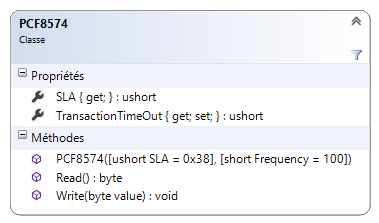

#PCF8574 .NetMF Class

<strong>Description</strong>
-------------------------------------
Source code of the PCF8574. A <strong>NETMF4.3 class</strong> write for a PCF8574 circuit : <strong>remote 8-bit I/O expander for I 2C-bus</strong>. 

This class is also in the <a href="https://www.nuget.org/packages/WEBGE.Microtoolskit/" target="_blank">MicroToolsKit</a> <strong>library</strong>. Download at <a href="https://www.nuget.org" target="_blank">nuget.com</a>

 

<strong>Content of the visual studio solution</strong>
-------------------------------------
<ul>
<li>PCF8574 : .NetMF class</li>

<li>Netduino : test program (chenillard) for Netduino board</li>
<li>FezPanda : test program (chenillard) for Fez Panda board</li>
</ul>

<strong>Tags</strong>: I²C Bus, Netduino, FEZ, PANDA, COBRA, C#, NETMF, Visual Studio.

<strong>Target</strong>: Netduino, Netduino plus 2, Netduino 3, FEZ PANDA 3 et COBRA 3.

<strong>IDE</strong> : Visual Studio Community - 
<strong>Language</strong> : C# - 
<strong>Framework</strong> : .NETMF 4.3

See <a href="http://webge.github.io/PCF8574/" target="_blank">PCF8574 GitHub Pages</a> too get started.

Maintened by <a href="mailto:philippemariano@gmail.com">Philippe Mariano</a>
